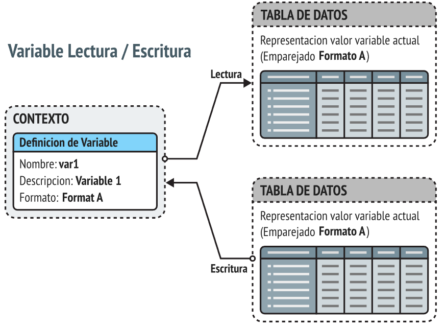
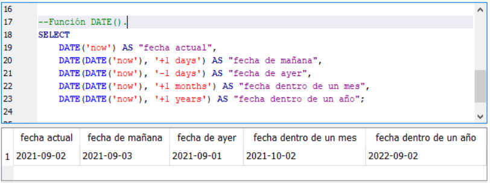
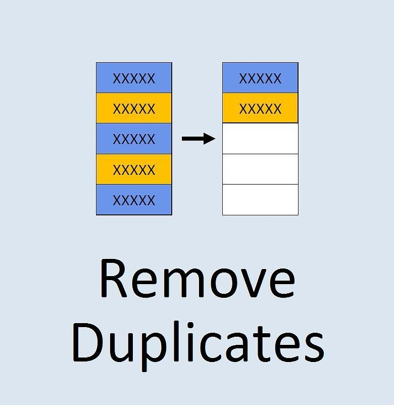

# Limpieza de datos SQLServer = Casas en Nashville (Nashville Housing)

Este proyecto se desarrolla a través de unos datos extraidos de las casas del condado de nashville y tiene la finalidad de exponer algunas funciones de SQL Server que servirán para la limpieza de datos como por ejemplo:
```
Crear nuevas columnas
Cambiar datos similares en datos únicos
Cambiar Formato de datos en fechas
Eliminar Duplicados
Eliminar datos improductivos
```
<p>
  La Limpieza de Datos en SQL Server se refiere al proceso de transformar y organizar los datos contenidos en la tabla para mejorar su calidad, consistencia y utilidad. El objetivo principal de este proyecto es presentar y aplicar diversas funciones y técnicas disponibles en SQL Server con el propósito de optimizar la integridad y la precisión de los datos. Algunas de las acciones destacadas que se llevarán a cabo son:
</p>


<div>
  <p id="texto">Creación de Nuevas Columnas: Se pueden generar columnas adicionales que calculen valores derivados de los datos existentes. Estas nuevas columnas podrían proporcionar información más específica o realizar cálculos relevantes para el análisis posterior.</p>  
</div>




<div>
  <p id="texto">Unificación de Datos Similares: En ocasiones, los datos pueden tener variaciones mínimas pero significativas, como errores tipográficos o formatos diferentes para la misma información. La limpieza implica consolidar estos datos similares en valores únicos y consistentes.</p>  
</div>



<div>
  <p id="texto">Normalización de Fechas: Cuando las fechas se presentan en varios formatos o están mal formateadas, la limpieza de datos puede implicar estandarizarlas en un único formato coherente, lo que facilita su análisis y comparación.</p>  
</div>



<div>
  <p id="texto">Eliminación de Duplicados: La presencia de registros duplicados puede afectar negativamente la calidad de los análisis y los resultados obtenidos. La limpieza de datos puede incluir la identificación y eliminación de duplicados para mantener la integridad de la tabla.</p>  
</div>


<div>
  <p id="texto">Eliminación de Datos Improductivos: En algunas situaciones, ciertos registros o columnas pueden contener información irrelevante o obsoleta. La limpieza implica eliminar o filtrar estos datos para reducir el ruido y concentrarse en la información relevante.</p>  
</div>

<p>
  Al finalizar el proyecto, se espera que los datos en la tabla «Nashville Housing» estén mejor organizados, sean más coherentes y estén listos para un análisis más preciso y efectivo. Este proceso de limpieza contribuye a mejorar la confiabilidad de los resultados obtenidos al realizar consultas y análisis sobre los datos, lo que a su vez puede conducir a decisiones más informadas y mejores insights en cualquier tarea que involucre el uso de estos datos.
</p>


